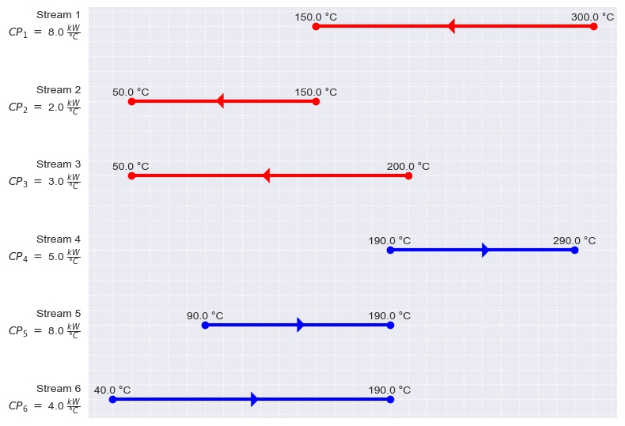
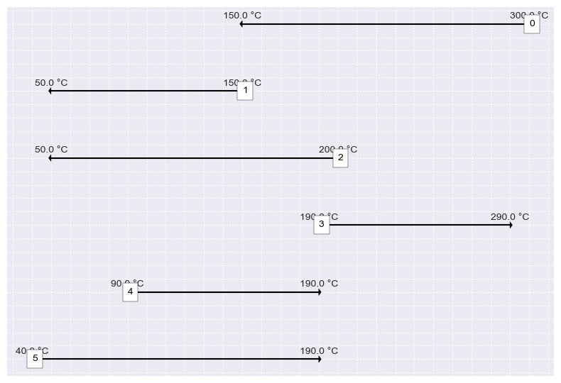
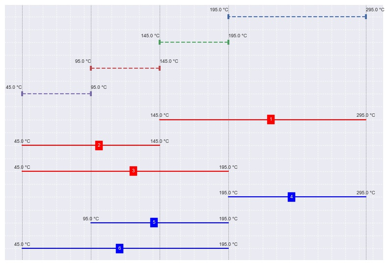
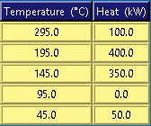
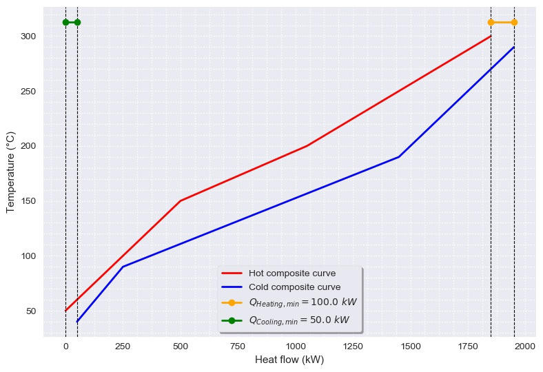

# PinchAnalysis - Heat Integration Analysis
This application allows calculate heat integration for heat exchangers.

## Installation
For installing this application:

**```pip install PinchAnalysis```**


## Usage
This application uses the pinchStream class, which requires attaching a plain text file to the folder where the application is hosted. This class allows to visualize the specifications of the streams and the table of shifted temperatures as well as to generate the composite curve, the grand composite curve and the corresponding heat flow cascade.

## Required information
The plain text file must have the following information:

* <a href="https://www.codecogs.com/eqnedit.php?latex=\dot{Q}" target="_blank"></a>
* <a href="https://www.codecogs.com/eqnedit.php?latex=T_{min}" target="_blank"></a>
* <a href="https://www.codecogs.com/eqnedit.php?latex=T_{min}" target="_blank"></a>
* <a href="https://www.codecogs.com/eqnedit.php?latex={\Delta&space;T}_{min}" target="_blank"></a>

The corresponding plain text file will be in the next way:

**```Q_dot T_start T_target dT_min```**

## How to manipulate the application?

First, the instance of the class is generated using the pinchStream notation ('Data'):

```python
pinchStream('Data')
```

It should be noted that the string 'Data' corresponds to the name of the plain text file. If you want to work on multiple plain text files that contain streams information, their names must vary only numerically, that is, if there is a second file on which you want to perform calculations, it should be called 'Data2' and so on consecutively.

The available options for the pinchStream class are the following:

```python
['__class__', '__delattr__', '__dict__', '__dir__', '__doc__', '__eq__', '__format__', '__ge__', '__getattribute__', '__gt__', '__hash__', '__init__', '__init_subclass__', '__le__', '__lt__', '__module__', '__ne__', '__new__', '__reduce__', '__reduce_ex__', '__repr__', '__setattr__', '__sizeof__', '__str__', '__subclasshook__', '__weakref__', 'cascadeTable', 'compositeCurve', 'drawCascade', 'grandCompositeCurve', 'shiftedTemperatures', 'streamData']
```

The following are the basic formats to perform the respective calculations:

```python
pinchStream('Data') # Create the instance for Data.txt file
pinchStream('Data').streamData() # Show the information of the streams for Data.txt
pinchStream('Data').shiftedTemperatures() # Show the shifted temperature table for Data.txt
pinchStream('Data').compositeCurve() # Show the composite curve for Data.txt
pinchStream('Data').grandCompositeCurve() # Show the grand composite curve for Data.txt
pinchStream('Data').drawCascade() # Draw the heat flow cascade for Data.txt
pinchStream('Data2') # Create the instance for Data2.txt file
```

### Calculations


The elements generated for each method of the pinchStream class are detailed below.

Method | Functionality | Arguments
------------ | ------------- | -------------
```streamData``` | It displays a table with the information for streams | Default: T_units='°C', Q_units='kW'
```drawStreams``` | Draw | Default: Data='1', T_units='°C', Q_units='kW'
```shiftedTemperatures``` | Draw | Default: T_units='°C', Q_units='kW'
```initialGridDiagram``` | Draw | Default: Data='1', T_units='°C', Q_units='kW'
```drawIntervals``` | Draw | Default: Data='1', T_units='°C', Q_units='kW'
```cascadeTable``` | Draw | Default: Data='1', T_units='°C', Q_units='kW'
```compositeCurve``` | Draw | Default: Data='1', T_units='°C', Q_units='kW'
```grandCompositeCurve``` | Draw | Default: Data='1', T_units='°C', Q_units='kW'
```drawCascade``` | Draw | Default: Data='1', T_units='°C', Q_units='kW'

### Calculation examples

**First example**

**Example 15.2 (Data.txt)** _[Adapted from Analysis, Synthesis and Design of Chemical Processes, Richard Turton, Richard C. Baille, Wallace B. Whiting, Joseph A. Shaeiwitz, page 525]_
In a process, there are a total of six streams that require heating and cooling. These are listed below along with their thermal and flow data. A stream is referred to as "hot" if it requires cooling, and "cold" if it requires heating. The temperature of the stream is not used to define whether it is "hot" or "cold".

Stream | Condition | <a href="https://www.codecogs.com/eqnedit.php?latex=T_{in}&space;\&space;(^{}\circ&space;C)" target="_blank"></a> | <a href="https://www.codecogs.com/eqnedit.php?latex=T_{out}&space;\&space;(^{\circ}&space;C)" target="_blank"></a>| <a href="https://www.codecogs.com/eqnedit.php?latex={\dot{Q}}_{available}&space;\&space;(kW)" target="_blank"></a>
------------ | ------------- | ------------- | ------------- | ------------- |
1 | Hot | 300 | 150 | 1200 |
2 | Hot | 150 | 50 | 200 |
3 | Hot | 200 | 50 | 450 |
4 | Cold | 190 | 290 | -500 |
5 | Cold | 90 | 190 | -800 |
6 | Cold | 40 | 190 | -600 |

Generate the tables corresponding to the specifications of the currents, the temperatures of interval and the cascade of heat flow as well as the graphs of cumulative enthalpies and grand composite.

#### Specifications for streams
Create the plain text file with the requires information.


#### Shifted temperatures
Calculate the temperatures corrected by the minimum approach.


#### Diagram for streams
Draw the streams with information



#### Initial grid diagram
Draw the initial grid diagram



#### Intervals of temperature
Draw the intervals for shifted temperatures



#### Heat flow cascade
Calculate the corresponding heat flow cascade



#### Cumulative enthalpies
Elaborate the graph of cumulative enthalpies



#### Grand composite curve
Elaborate the grand composite graphic


**Second example**

**Example 5.4**
**Example 10.2 HENS Problem 4SP1** _[Adapted from SYSTEMATIC METHODS OF CHEMICAL PROCESS DESIGN, L. T. Biegler, I. E. Grossmann, A. W. Westerberg, page X]_
The literature contains several test problems for testing the effectiveness of heat exchanger work synthesis algorithms. Problem 4SP1 (four streams problem number 1) is one of the shall use it to illustrate how to use Hohmann/Lockhart composite curves to compute mixed utility use for a heat exchanger network synthesis problem. Table 10.6 gives the data for the problem.

Stream | Condition | <a href="https://www.codecogs.com/eqnedit.php?latex=T_{in}&space;\&space;(^{}\circ&space;C)" target="_blank"></a> | <a href="https://www.codecogs.com/eqnedit.php?latex=T_{out}&space;\&space;(^{\circ}&space;C)" target="_blank"></a>| <a href="https://www.codecogs.com/eqnedit.php?latex={\dot{Q}}_{available}&space;\&space;(kW)" target="_blank"></a>
------------ | ------------- | ------------- | ------------- | ------------- |
1 | Cold | 60 | 160 | 762.0 |
2 | Cold | 116 | 260 | 875.5 |
3 | Hot | 160 | 93 | 588.9 |
4 | Hot| 249 | 138 | 1171.1 |
