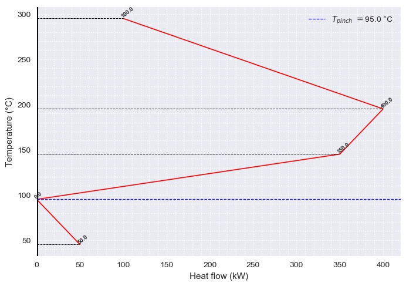

# PinchAnalysis
This application allows calculate heat integration for heat exchangers.

## Usage
To use this application, it is necessary to attach a plain text file document with the information of each stream to analyze. The required information is the heat required in the stream, the inlet or start temperature, the exit or target temperature and the minimum approach. In the same way, the units of temperature and heat flow must be specified.

## Required information
The plain text file must have the following format and the same order:

* 
* 
* 
* 

### Calculation example
**Example 15.2** _[Adapted from Analysis, Synthesis and Design of Chemical Processes, Richard Turton, Richard C. Baille, Wallace B. Whiting, Joseph A. Shaeiwitz, page 525]_
In a process, there are a total of six streams that require heating and cooling. These are listed below along with their thermal and flow data. A stream is referred to as "hot" if it requires cooling, and "cold" if it requires heating. The temperature of the stream is not used to define whether it is "hot" or "cold".

Stream | Condition |  | | 
------------ | ------------- | ------------- | ------------- | ------------- |
1 | Hot | 300 | 150 | 1200 |
2 | Hot | 150 | 50 | 200 |
3 | Hot | 200 | 50 | 450 |
4 | Cold | 190 | 290 | -500 |
5 | Cold | 90 | 190 | -800 |
6 | Cold | 40 | 190 | -600 |

Generate the tables corresponding to the specifications of the currents, the temperatures of interval and the cascade of heat flow as well as the graphs of cumulative enthalpies and grand composite.

#### First step
Create the plain text file with the requires information.

#### Second step

#### Third step

#### Fourth step

#### Fifth step

